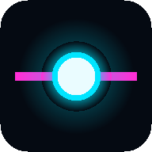

<div align="center">



# ZONA ZERO

**Cerque as bolinhas. Não encoste nelas.**

Arcade neon inspirado no clássico JezzBall — com um twist: você está **dentro** da arena.

### 🎮 [JOGAR AGORA → riquena969.github.io/zero-zone](https://riquena969.github.io/zero-zone/)

*Roda no navegador — PC e celular (paisagem). Instalável como app (PWA), funciona offline.*

</div>

---

## O jogo

No JezzBall original você era um cursor seguro, clicando de fora. Aqui você é um **orbe de energia preso na arena** com as bolinhas. Dispare paredes divisórias a partir de onde estiver: quando uma parede completa, **toda área desconectada das bolinhas vira território seu**. Conquiste a meta da zona para avançar.

A tensão é essa: cada parede que você fecha também **aperta o espaço em que VOCÊ está confinado** com o perigo. Prenda as bolinhas em jaulas pequenas, escale paredes para escapar de ciladas, e sobreviva até a ZONA ZERO de espaço livre.

### Regras em 30 segundos

- 🧱 **H** dispara parede horizontal, **V** vertical — a partir do orbe. Uma por vez, sem cancelar.
- 💥 Bolinha bateu na parede **em construção**? Ela quebra e custa **1 vida**. Mas a metade que já ancorou **fica** — tocos viram terreno tático (fiel ao clássico).
- ☠️ Encostou numa bolinha = perdeu vida. 3 vidas, +1 por zona (teto 6).
- 🧗 Preso? **Segure contra uma parede pronta ~0,4s** e o orbe escala para o outro lado. Pouso por sua conta e risco.
- 🏆 Fills gigantes (≥15% da arena) valem **2×**; sequências sem erro sobem o **combo**; fechar a zona rende bônus de vidas, excedente e tempo.

## Features

- **12 zonas desenhadas + modo infinito** — dificuldade por fórmula com teto de física (nunca vira loteria)
- **4 bolas especiais**: veloz (pequena, 1.6×), gigante (difícil de cercar), fantasma (esmaece, o contorno nunca some), perseguidora (te caça com um olho te encarando)
- **3 power-ups** que nascem perto do perigo: ⏱ relógio (bolas a 50% por 5s), 🛡 escudo (absorve 1 toque), ⏩ turbo (próxima parede 2×)
- **Música synthwave 100% procedural** (WebAudio, zero arquivos): BPM e camadas sobem com o % conquistado, lead extra na reta final, desacelera sob o relógio
- **3 temas visuais** selecionáveis: Tron (padrão), Synthwave, Fliperama — persistidos
- **Placar top-10 local** com iniciais de 3 letras estilo fliperama + compartilhar pontuação
- **Juice arcade**: partículas neon, screen shake, hit-stop na quebra, glow, rastro do orbe — com toggles de acessibilidade (tremida/flash/vibração)
- **Mobile de verdade**: joystick flutuante + botões com multitouch simultâneo, tela cheia, vibração
- **PWA**: instala na home, joga offline

## Controles

| Ação | PC | Celular (paisagem) |
|------|----|--------------------|
| Mover o orbe | Setas ou WASD | Joystick flutuante (lado esquerdo) |
| Parede horizontal | **H** | Botão **H** |
| Parede vertical | **V** | Botão **V** |
| Escalar parede | Segurar direção contra ela | idem, com o joystick |
| Pausar | Esc / P | Botão ⏸ |
| Mudo | M | Menu de pausa |
| Reiniciar run | R | Menu de pausa |

## As zonas

| Zona | Novidade |
|------|----------|
| 1 | Tutorial — 1 bolinha lenta, meta 60% |
| 3 | Power-up **Relógio** |
| 4 | Bola **veloz** |
| 5 | Power-up **Escudo** |
| 6 | Bola **gigante** |
| 7 | Power-up **Turbo** |
| 8 | Bola **fantasma** |
| 10 | Bola **perseguidora** |
| 12 | Mistura final, meta 80% |
| 13+ | **Infinito**: +bolas, +velocidade, mix cada vez mais maligno → platô de skill puro |

## Rodar localmente

```bash
git clone https://github.com/riquena969/zero-zone.git
cd zero-zone
python3 -m http.server 8080   # ou: npm run serve
# abra http://localhost:8080
```

**Zero dependências, zero build.** JavaScript vanilla + Canvas 2D, ES modules servidos estáticos. Se abre um servidor de arquivos, roda.

## Desenvolvimento

```bash
npm test   # node --test — 110 testes headless (Node ≥ 20)
```

### Arquitetura

```
src/
├── main.js         # raiz de composição: única ponte entre o jogo puro e o DOM
├── config.js       # TODOS os tunables (velocidades, pontuação, 3 paletas de tema)
├── core/           # loop de timestep fixo 60Hz + máquina de estados de telas
├── game/           # ★ PURO (zero DOM — importável no Node = testável headless)
│   ├── grid.js     #   grade 160×83 células, flood fill, conquista por conectividade
│   ├── walls.js    #   parede em crescimento: ancoragem, fragilidade, tocos
│   ├── game.js     #   ordem canônica do tick; retorna eventos (o main roteia p/ áudio/fx)
│   └── ...         #   bolas, jogador/vault, power-ups, níveis, pontuação, colisão, rng
├── services/       # storage: KV (localStorage + fallback) atrás de interface trocável
└── ui/             # a ÚNICA camada que toca DOM: render, input, touch, áudio, telas, fx
```

Decisões-chave: **grade + flood fill** (o modelo do JezzBall original — % de área por contagem inteira exata, tocos em L/T de graça) · **determinismo** (timestep fixo + PRNG seedado → o jogo inteiro roda por script nos testes) · **eventos puros** (o game não conhece áudio/partículas; emite eventos e o `main.js` roteia).

O plano completo de implementação (15 fatias) e a spec de design estão em [`docs/PLANO.md`](docs/PLANO.md) e [`docs/superpowers/specs/`](docs/superpowers/specs/2026-07-23-zona-zero-design.md).

### Deploy

Push na `main` publica via GitHub Pages. **Antes de cada deploy, bump da versão do cache no `sw.js`** (`zona-zero-v1` → `v2`) — é o que força o PWA instalado a atualizar.

---

<div align="center">

Feito por **Kevin Riquena** com [Claude Code](https://claude.com/claude-code) · PT-BR 🇧🇷

</div>
